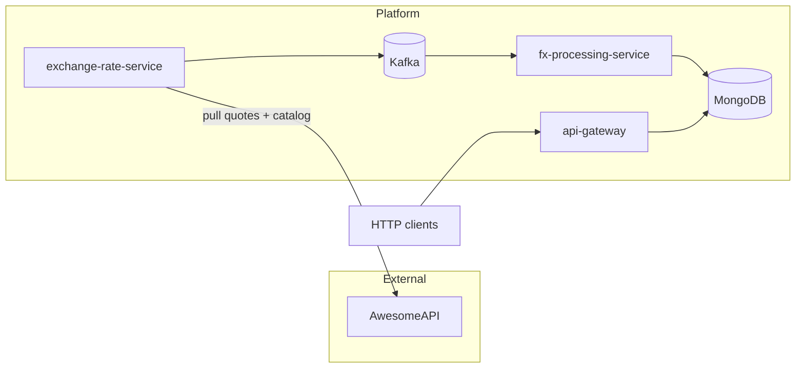

# Architecture

This document describes the high-level design of **fx-event-platform**: bounded contexts, runtime flow, technology choices, and how the three Spring Boot services interact.

## System context

**Important:** the public FX API does **not** call your services. **exchange-rate-service** is the **HTTP client**: an internal **scheduler** triggers polling; the service **pulls** data from AwesomeAPI, then **publishes** to Kafka. End users (or tools) call **api-gateway** for rates and conversion; the optional `GET` on **exchange-rate-service** (`/exchange-rate/state`, port 8081) is only for debugging the in-memory cache, not the main product path.

- **exchange-rate-service** is the only component that **calls** the public FX API (outbound HTTPS). It publishes **JSON** events to Kafka.
- **fx-processing-service** consumes those events and **upserts** normalized rates into MongoDB.
- **api-gateway** is read-only: it serves client traffic and queries MongoDB (no direct Kafka access).

## Data flow (happy path)

1. A scheduler in **exchange-rate-service** runs on a fixed interval (`fx.poll.api-interval-ms`, often set via `FX_POLL_API_INTERVAL_MS`).
2. The service obtains the set of pairs to poll in one of two ways:
   - **Catalog mode (default)**: refresh `/json/available` when stale (capped by `fx.poll.max-pairs`), then request `/json/last/{pairs}` in **batches** (up to **45** hyphen pairs per HTTP call).
   - **Fixed USD quotes mode**: if `fx.poll.fixed-usd-quotes` / `FX_POLL_FIXED_USD_QUOTES` is set (CSV of quote currencies), build `USD-QUOTE` pairs directly and fetch quotes without going through the catalog refresh inside the use case (still subject to any client warm-up behavior on startup).
3. AwesomeAPI requests optionally append `token` from `fx.awesome-api.token` / `FX_AWESOME_API_TOKEN`.
4. For each pair, it updates in-memory state and produces a message to the topic **`exchange-rate-events`** (key = pair, value = JSON payload with pair, rate, timestamp, source `API`). If the live quote is missing for a pair but a cached API rate exists, it republishes that cached value for that run.
5. **fx-processing-service** consumes the topic, deserializes to the domain model, and **upserts** into collection **`exchange_rates`** (compatible schema for gateway reads).
6. **api-gateway** resolves **GET `/rates?pair=BASE/QUOTE`** by primary key lookup and **POST `/convert`** by building a graph from all stored pairs and walking cross-rate paths (BFS).

## Module responsibilities

### exchange-rate-service

| Concern | Implementation sketch |
|--------|-------------------------|
| Pair discovery | `AwesomeAvailablePairsClient` loads `/json/available`, capped by `fx.poll.max-pairs`. |
| Quotes | `AwesomeApiClient` calls `/json/last/{pair1},{pair2},...` in chunks. |
| Pair selection | `FetchExchangeRateUseCase` uses catalog mode **or** `fx.poll.fixed-usd-quotes` to pin `USD-*` pairs (lower outbound HTTP when the catalog would be large). |
| Awesome auth | Both HTTP clients append `token` when configured (`fx.awesome-api.token`). |
| State | `InMemoryExchangeRateState` holds last API and last published rate per display pair. |
| Egress | `KafkaProducerAdapter` serializes `ExchangeRateEventPayload` to String. |
| Optional HTTP | `GET /exchange-rate/state` for debugging cache under `infrastructure.web`. |

### fx-processing-service

| Concern | Implementation sketch |
|--------|-------------------------|
| Ingress | `KafkaConsumerAdapter` + `ObjectMapper` → `ProcessExchangeRateUseCase`. |
| Persistence | `MongoRepositoryAdapter` + Spring Data; document id and `pair` field align with unique indexes. |

### api-gateway

| Concern | Implementation sketch |
|--------|-------------------------|
| Read model | `MongoRepositoryAdapter` returns `ExchangeRateSnapshot` for latest-by-pair and for all distinct pairs. |
| Domain | `CurrencyBridge` models pairs as edges (forward and inverse) for conversion. |
| HTTP | `infrastructure.web` controllers and DTOs; `ApiExceptionHandler` maps validation and `IllegalArgumentException` to 400. |

## Layering (per service)

Each service follows a simple **hexagonal** layout:

- **`domain`** — entities, value objects, domain services (no Spring).
- **`application`** — use cases and **ports** (`port.in` if present, `port.out` for infrastructure).
- **`infrastructure`** — adapters: REST (`infrastructure.web`), messaging, HTTP clients, persistence, config, scheduling.

There is no separate `presentation` package; web controllers live under **`infrastructure.web`**.

## Infrastructure (Docker Compose)

- **MongoDB 7** — persistent volume `mongo_data`; API and processing use database `fx`.
- **Kafka 3.8 (KRaft)** — single broker; `KAFKA_LOG_DIRS` on `tmpfs` with permissive mode so the non-root image can write; advertised listener `kafka:9092` for inter-container use, host port `9092` for local tooling.
- **Java services** — multi-stage Dockerfiles: **Maven Wrapper** (`mvnw`) build, JRE 21 runtime, single fat JAR.

## Production notes (Easypanel / private networking)

- **Kafka** is a **TCP** service: expose **`9092`** as a port mapping; do not treat it like an HTTP “domain” route.
- **Mongo URI** must include a **non-empty database name** in the path (Spring Data Mongo will fail fast if it is empty).
- **CI deploy**: GitHub Actions can call Easypanel deploy webhooks (see `.github/workflows/deploy.yml`).

## Observability

- **Spring Boot Actuator** on all three apps: `health`, `info`, `metrics` (see each `application.yml`).

## Testing strategy (summary)

- Unit tests for domain and use cases; **Mockito** for ports.
- **WebMvcTest** for HTTP adapters with use-case configuration imported.
- **Integration tests** where needed: **Embedded Kafka** for producer/consumer, **Testcontainers** for Mongo in full context tests (where enabled).

## Further reading

- Use-case rules are documented in Javadoc on `GetLatestRateUseCase`, `ConvertCurrencyUseCase`, `FetchExchangeRateUseCase`, and `ProcessExchangeRateUseCase`.
- `README.md` at the repository root lists ports, env vars, and example `curl` calls.
